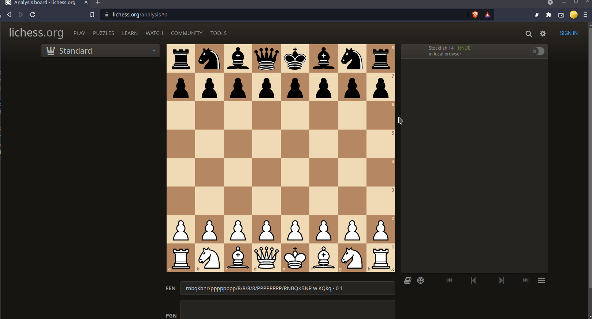

# Partially Blindfold Lichess
Extension for chromium based browsers that allows you to hide some of yours or opponents
pieces from the chessboard and play "partially blindfolded".

Available from chrome webstore https://chrome.google.com/webstore/detail/partially-blindfold-liche/aoiefionkjnhljdoolofapmdheialhga

### Issues
- [ ] when checked, king is always visible
- [ ] hiding a piece after another piece of the same type was already taken off the board and
then navigating back in the game will not hide the piece that was taken (refresh the page to fix) 

If you don't want to see the legal moves after selecting a piece, go to https://lichess.org/account/preferences/game-display and set `Piece destinations (valid moves and premoves)
` to `No`.
